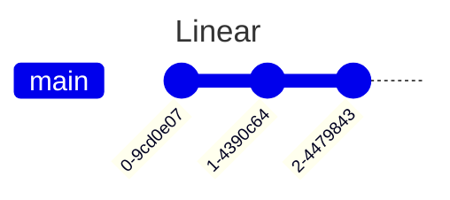
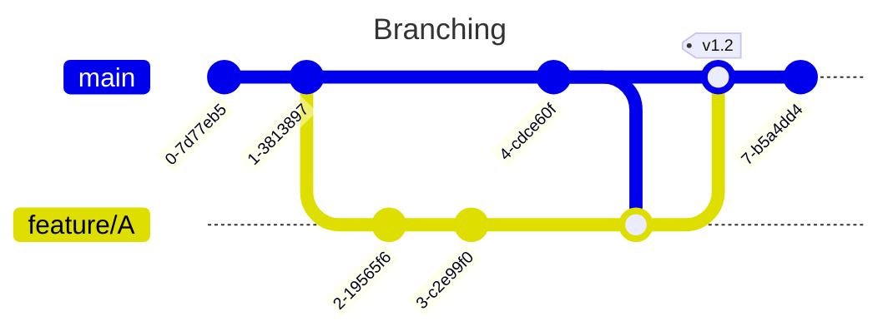

# Git Version Control

  

```mermaid {theme: 'base'}
---
title: Linear
---
gitGraph
   commit
   commit
   commit
```
  

    

```mermaid {theme: 'base', scale: '1.2'}
---
title: Branching
---
gitGraph
   commit
   commit
   branch 'feature/A'
   checkout 'feature/A'
   commit
   commit
   checkout main
   commit
   checkout 'feature/A'
   merge main
   checkout main
   merge 'feature/A' tag:'v1.2'
   commit
```
    

