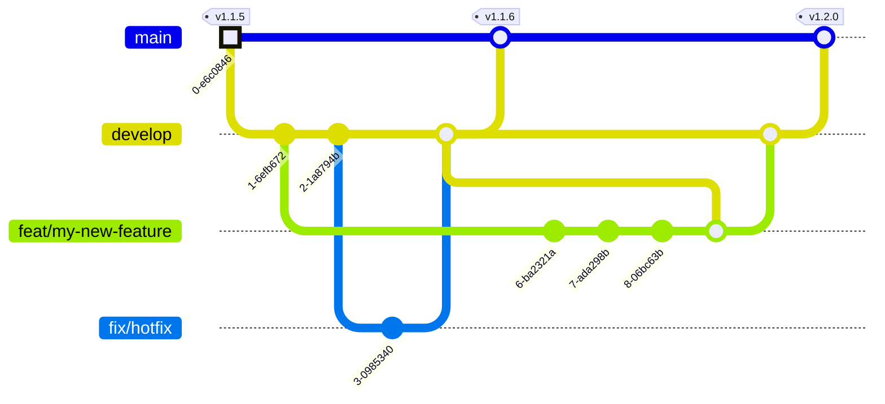

# GitOps

```mermaid {theme: 'base', scale: '1.1'}
gitGraph:
  commit type: HIGHLIGHT tag:'v1.1.5'
  branch develop
  checkout develop
  commit
  branch feat/my-new-feature
  checkout develop
  commit
  branch fix/hotfix
  checkout fix/hotfix
  commit
  checkout develop
  merge fix/hotfix
  checkout main
  merge develop tag:'v1.1.6'
  checkout feat/my-new-feature
  commit
  commit
  commit
  merge develop
  checkout develop
  merge feat/my-new-feature
  checkout main
  merge develop tag:'v1.2.0'
```